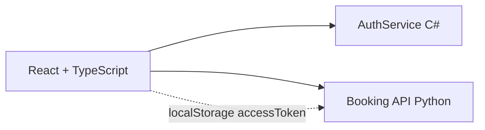

# Frontend - Reservas de Salas

Interface web em React 18, TypeScript, Vite e Axios para o sistema de reservas de salas. O visual segue o dashboard de referencia: sidebar escura, area principal clara, busca de salas, metricas, calendario, salas em destaque e lista de reservas.

O frontend consome o AuthService para login/cadastro/usuarios e a Booking API para locais, salas e reservas. O JWT fica no `localStorage` e e enviado por interceptor Axios nas chamadas protegidas.

## Arquitetura



## Variaveis

| Variavel | Obrigatoria | Descricao | Exemplo |
| --- | --- | --- | --- |
| `VITE_AUTH_API_URL` | Sim | URL do Auth Service | `http://localhost:5000` |
| `VITE_BOOKING_API_URL` | Sim | URL da Booking API | `http://localhost:8000` |
| `VITE_ENABLE_DEMO_DATA` | Nao | Dados fake para desenvolvimento sem backend | `false` |

## Como Rodar

```powershell
npm install
npm run dev -- --host 127.0.0.1
```

URL padrao: `http://localhost:5173`.

## Build/Teste

```powershell
npm run build
```

## Funcionalidades

- Login e cadastro com redirecionamento para o painel.
- Interceptor Axios com `Authorization: Bearer <token>`.
- Interceptor de `401` limpa sessao e redireciona para login.
- Listagem de reservas com titulo, sala, local, responsavel, descricao e horario.
- Listagem nao exibe cafe nem quantidade de pessoas, conforme PDF.
- Criacao, edicao e exclusao individual com modal de confirmacao.
- Exclusao em lote por checkbox.
- Calendario com dias marcados quando ha reservas.
- Busca de salas por data, horario e capacidade.
- CRUD de salas e unidades/filiais.
- Hierarquia `admin`/`user` com permissoes editaveis por administrador.
- Upload de foto e alteracao de senha em perfil e edicao administrativa.
- Sistema global de toasts para erros, sucessos, avisos e informacoes.
- Logo `BANANALTDA.svg` aplicada sem texto de marca extra.

## Decisoes

- `localStorage`: aceitavel para o contexto do teste e exigido/permitido na especificacao enviada.
- Toasts globais: padronizam todos os tipos de notificacao do sistema.
- TypeScript `strict: true`: reduz risco de contratos inconsistentes com as APIs.
- Componentes por feature: mantem autenticacao e reservas separadas.
