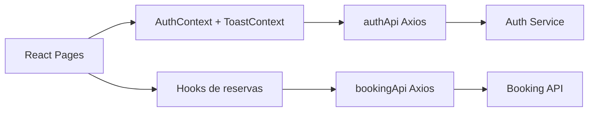

# Frontend

Aplicacao web que consome o Auth Service para login/cadastro e a Booking API para locais, salas e reservas. O usuario autentica, recebe um JWT e o frontend envia esse token nas chamadas protegidas.

O projeto usa React 18, TypeScript, Vite, Axios e React Router. O layout foi adaptado para desktop e mobile, com menu hamburguer, notificacoes, perfil, telas administrativas para usuarios admin e CRUD de reservas, salas e unidades.

## Arquitetura



## Pre-requisitos

| Ferramenta | Versao |
| --- | --- |
| Node.js | 20+ |
| npm | 10+ |

## Variaveis de ambiente

| Variavel | Obrigatoria | Descricao | Exemplo |
| --- | --- | --- | --- |
| `VITE_AUTH_API_URL` | Sim | URL do Auth Service. | `http://localhost:5000` |
| `VITE_BOOKING_API_URL` | Sim | URL da Booking API. | `http://localhost:8000` |
| `VITE_ENABLE_DEMO_DATA` | Nao | Usa dados mockados quando APIs falham. | `false` |

## Como rodar localmente

```bash
npm ci
npm run dev
```

Build de producao:

```bash
npm run build
```

Com Docker Compose na raiz:

```bash
docker compose up --build frontend
```

## Rotas e telas

| Rota | Auth | Descricao |
| --- | --- | --- |
| `/login` | Nao | Login com email e senha. |
| `/register` | Nao | Cadastro de novo usuario. |
| `/` | Sim | Dashboard, reservas, salas, calendario, relatorios e configuracoes conforme permissao. |

## Funcionalidades principais

| Area | Funcionalidade |
| --- | --- |
| Autenticacao | Login, cadastro, logout e redirecionamento quando token expira. |
| Reservas | Listar, criar, editar, excluir e excluir selecionadas em lote. |
| Conflito | Mostra mensagem legivel quando a Booking API recusa choque de horario. |
| Salas | Listar, criar, editar e excluir salas sem reservas vinculadas. |
| Unidades | Listar, criar, editar e excluir unidades sem salas vinculadas. |
| Calendario | Marca dias com reservas e abre reservas por data. |
| Perfil | Upload seguro de foto e troca de senha. |
| Usuarios | Admin lista, edita, exclui e ajusta permissoes. |

## Integracao com APIs

| Arquivo | Responsabilidade |
| --- | --- |
| `src/shared/api/authApi.ts` | Axios para Auth Service. |
| `src/shared/api/bookingApi.ts` | Axios para Booking API com interceptor JWT e tratamento de 401. |
| `src/shared/contexts/AuthContext.tsx` | Estado global de autenticacao. |
| `src/features/reservations/hooks/useReservations.ts` | Operacoes de reservas, salas e unidades. |

## Testes e verificacao

```bash
npm run build
```

O comando executa `tsc -b` e `vite build`, validando TypeScript strict e empacotamento.

## Decisoes tecnicas

| Decisao | Justificativa |
| --- | --- |
| React 18 + TypeScript | Atende ao requisito obrigatorio e melhora seguranca de tipos. |
| Axios interceptors | Centraliza envio do JWT e tratamento de sessao expirada. |
| localStorage | Aceitavel para o contexto do teste e simples para demonstrar integracao JWT. |
| Context API | Evita props drilling em autenticacao e toasts. |
| CSS responsivo | Mantem o painel usavel em desktop e mobile. |

